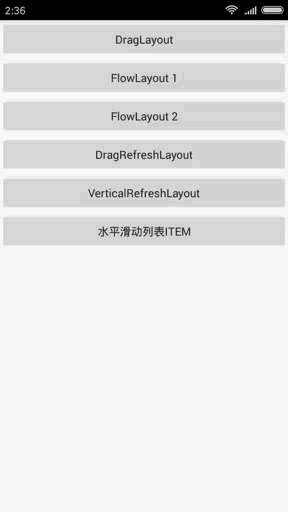
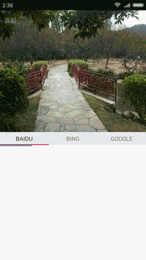
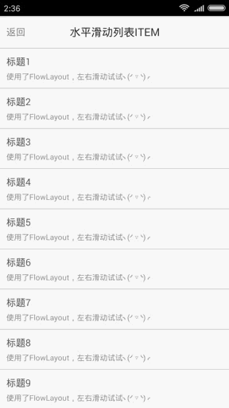
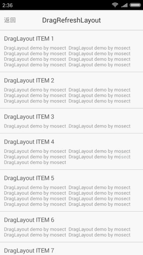

# DragLayout
Android拖拽布局，包括以下布局：
	DragLayout 基础布局类
	FlowLayout 可折叠布局，继承DragLayout
	DragRefreshLayout 拖拽刷新布局，继承DragLayout
	VerticalRefreshLayout 垂直刷新布局，继承DragRefreshLayout

## DragLayout
基础布局类，后面的布局都是继承此类。主要实现了上下左右四边的拖拽。可以继承此布局，改写其四边打开规则。


## FlowLayout
可折叠布局，优化四边的打开条件，可以实现类似商品详情或者列表ITEM左右拖拽菜单效果（需要改写RecyclerView或者ListView，具体使用方法请看Demo）。






## DragRefreshLayout
拖拽刷新布局，主要用于分页加载或者刷新，但一般不直接使用此类，此类作为分页加载基础类。

## VerticalRefreshLayout
垂直刷新布局，继承DragRefreshLayout，实现了分页加载和刷新功能，具体使用方式请看例子。


# 使用：
项目已上传jcenter，可以直接使用maven或gradle引用本库。

## Maven
```
<dependency>
  <groupId>com.mosect</groupId>
  <artifactId>DragLayout</artifactId>
  <version>1.0.3</version>
  <type>pom</type>
</dependency>
```

## Gradle
```
implementation 'com.mosect:DragLayout:1.0.3'
implementation 'com.mosect:ViewUtils:1.0.5'
```

# 更新记录
## 1.0.3
* 修复上次滑动未完成，下次直接打开周边出现瞬间闪屏的问题
* DragLayout直接继承ViewGroup，不继承FrameLayout
* 性能优化
* 修复视图未加载时，调用openTop、openLeft、openRight、openBottom方法导致页面布局错乱问题
## 1.0.2
* 优化滑动
* 移除ParentInterceptTouchHelper，改用ViewUtils库的InterceptTouchHelper
## 1.0.1
* 修复DragLayout canScrollHorizontally方法返回不正确问题（此问题会让包含DragLayout的ViewPager不能左滑）

# 其他：
```
个人网站：http://www.mosect.com 建设中……
邮箱：zhouliuyang1995@163.com
QQ：905340954
```
